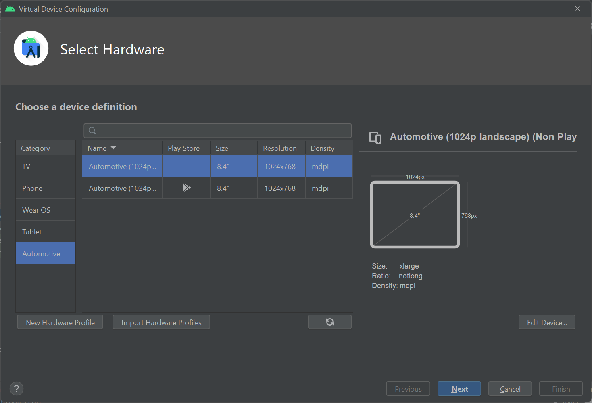
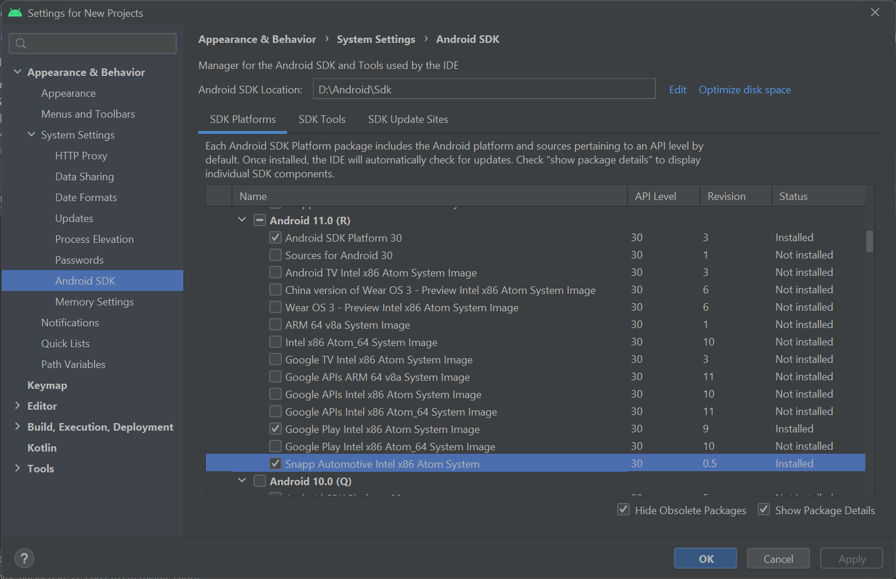
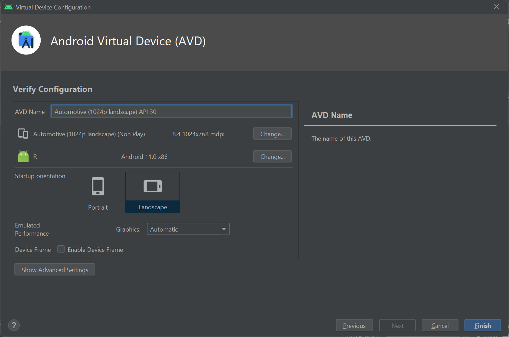

# Snapp Automotive README

## Building from scratch

You can find information on checking out and building the system images in [the repo manifest project](https://github.com/snappautomotive/firmware-repo-manifest).

## Using a pre-built image

If you want to try the emulator image first please follow the instructions below;

### Downloading the image in Android Studio

To add the Snapp Automotive Emulator Image to Android Studio you need to select the SDK Manager option from the Tools menu. When the dialog box opens click on the “SDK Update Sites” option and select the “+” symbol to add a new site.

The details are;

| Option | Setting |
| --- | --- |
| Name      | Snapp Automotive |
| URL       | https://images.snappautomotive.com/emulator/snapp-automotive-sys-img2-1.xml |
| Use Authentication | Unticked |

Now click “OK” on the dialog box, and then “Apply” in the bottom right corner of the “Update Sites” dialog. In the same dialog box click on the “SDK Platforms” header, and tick the “Show Package Details” box in the bottom right corner. You should see a list like this;

Under Android 11.0 (R)  there’ll be a “Snapp Automotive Intel x86 Atom System” image, you should ensure the box beside it is ticked and then click “OK”. You will now be told that the image will be installed and told the size of the download. Wait for the download to complete.

### Creating an emulator AVD

Select the AVD Manager from the Tools menu, and click on “+ Create Virtual Device” in the bottom left hand corner. Select the “Automotive” type on the left and “Automotive 1024p landscape” device, then click “Next”;

On the next screen you will be offered an Android R image which is called “11.0 Snapp Automotive”. Select it and click “Next”.

You can change the name of your AVD if you wish on the final dialog, or you can just click finish.

Now the AVD has been created you can start the emulator with the play button, sit back, and enjoy my dumb-ass boot animation and the Snapp Maps app based on Open Street Map and OSMDroid.
